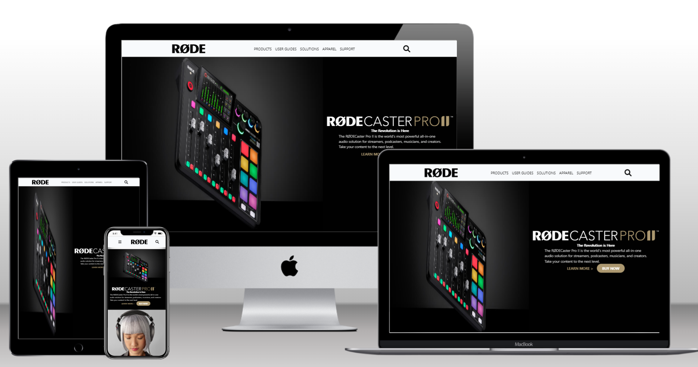

Hi there,

I have Built my third **Tailwind Project.**

 
>Clone of Rode.com Homepage

Take Aways,
 
Got a proper understanding on HTML and Tailwind CSS. 

Learned how to plan the design of anywebsite.

Learned how to read the documentation.

Gained confindence on building the websites. 

Learned how to code for long hours. 

Learned how to manage time. 

Learned how to approach a problem. 

Happy to see my Projects deployed and Live. It gives me a next level of confidence.

Now I have gained a confidence that I can build any website which is given to me. Thank You Hitesh Sir for pushing me hard enough. 
I have really pushed my  self to build these projects. 

Write more code and Build More Stuff!!!

[Livelink](https://rode-clone-vivektenali.netlify.app/)

  

## Screenshots

)

> Thank You  [Hitesh Sir](https://hiteshchoudhary.com/) for the guidance. 

**I Write Code**

 **ineuron.ai** 